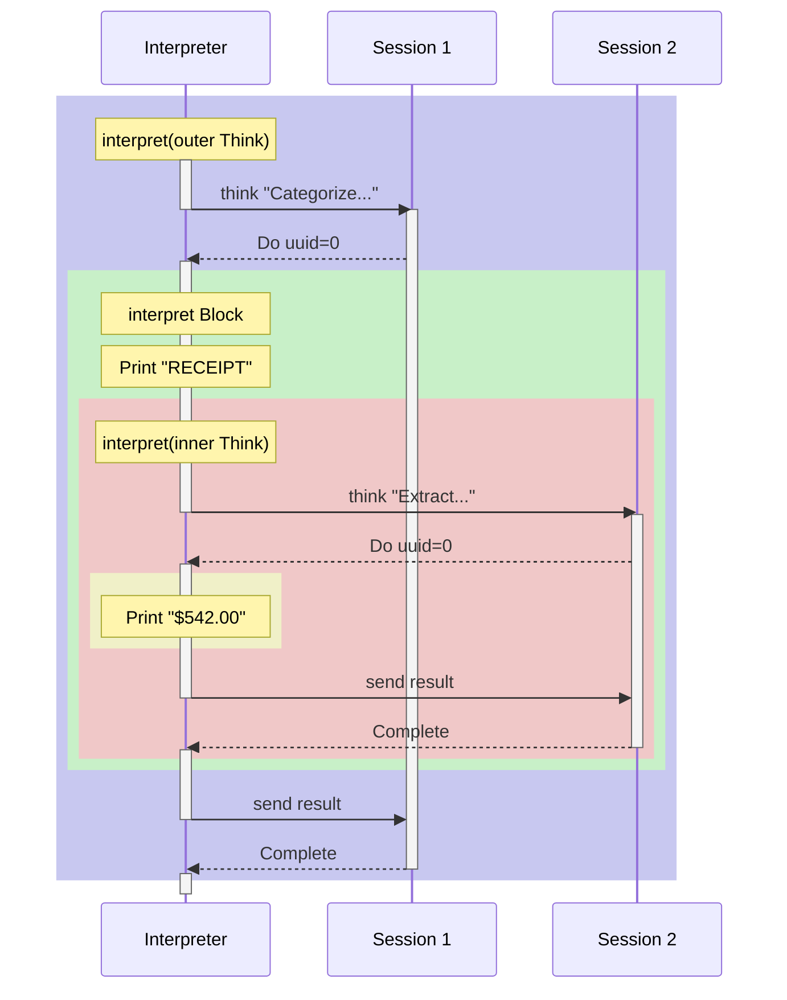

# The Interpreter

This chapter walks through how the interpreter executes the nested document categorization example. We'll trace the call stack and message flow step by step.

## The Example Program

We're executing this program (simplified for clarity):

```
Think "Categorize. do(0)=RECEIPT"
  [0]: Block
         Print "RECEIPT"
         Think "Extract amount. do(0)=confirm"
           [0]: Print "$542.00"
```

## The Interpreter Loop

The interpreter has two key methods:

- **`interpret(ast)`** - Pattern matches on the AST node type and executes it
- **`think(think)`** - Sends a prompt to the agent and waits for responses

```rust
fn interpret(&mut self, ast: &Ast) -> Result<String> {
    match ast {
        Ast::Print { message } => /* append message to output */,
        Ast::Block { children } => /* interpret each child */,
        Ast::Think { think } => /* call self.think(think) */,
    }
}

fn think(&mut self, think: &Think) -> Result<String> {
    // Send prompt to agent
    self.agent.send_prompt(AcpActorMessage::Think { prompt, tx });

    // Wait for responses
    for response in rx {
        match response {
            ThinkResponse::Do { uuid, do_tx } => {
                // LLM wants us to execute a subroutine
                let result = self.interpret(&think.children[uuid])?;
                do_tx.send(result);  // Send result back to LLM
            }
            ThinkResponse::Complete { message } => {
                return Ok(message);
            }
        }
    }
}
```

The key insight: `think` can call `interpret`, which can call `think` again. This is how nesting works.

## Execution Trace

Let's trace through our example. The colored boxes show recursive call frames - when you see a nested box, we've recursed into `interpret()` again:



Each nested `rect` represents a recursive call to `interpret()`. The activation bars on the Interpreter show when it's actively running vs blocked waiting for a response:

- The **blue** outer frame is the original `Think`
- The **green** frame is the `Block` executed when the LLM calls `do(0)`
- The **red** frame is the nested `Think` inside that Block - Session 2 activates here
- The **yellow** frame is the `Print` inside the inner Think

Session 1 remains active (blocked) while we recursively handle Session 2.

## The Call Stack

At the deepest point of execution, the call stack looks like:

```
interpret(outer Think)
  └─ think("Categorize...")        // waiting for outer LLM
       └─ interpret(Block)
            └─ interpret(Print "RECEIPT")
            └─ interpret(inner Think)
                 └─ think("Extract...")  // waiting for inner LLM
                      └─ interpret(Print "$542.00")
```

Notice that:
1. The outer `think()` is blocked, waiting for its `rx` channel
2. While blocked, it called `interpret()` which called another `think()`
3. The inner `think()` is now the active one
4. When inner completes, we unwind back to outer

## The Channel Dance

Each `think()` call creates a channel pair `(tx, rx)`:

- **tx** is sent to the agent (so it can send `ThinkResponse` messages back)
- **rx** is used in the `for response in rx` loop

When the interpreter calls `interpret()` recursively during a `do`, the outer `think()` is still holding its `rx` - it's just not reading from it yet. It will resume reading after the recursive call returns.
